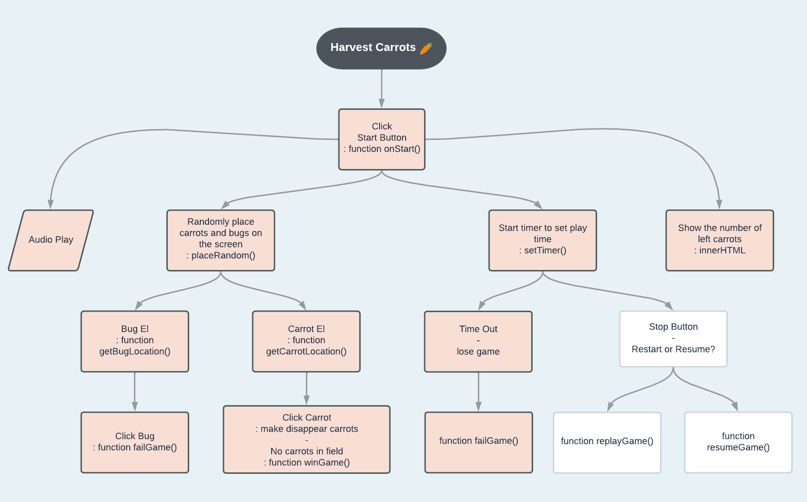
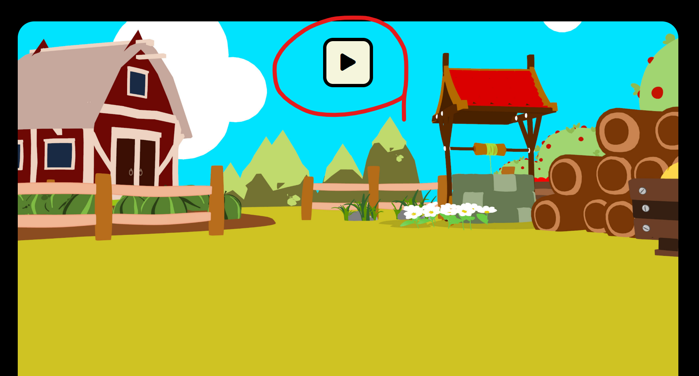
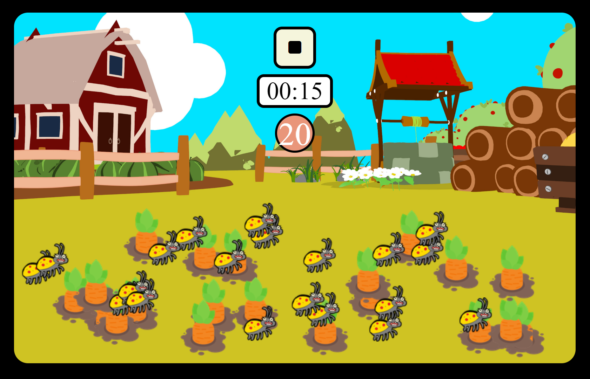
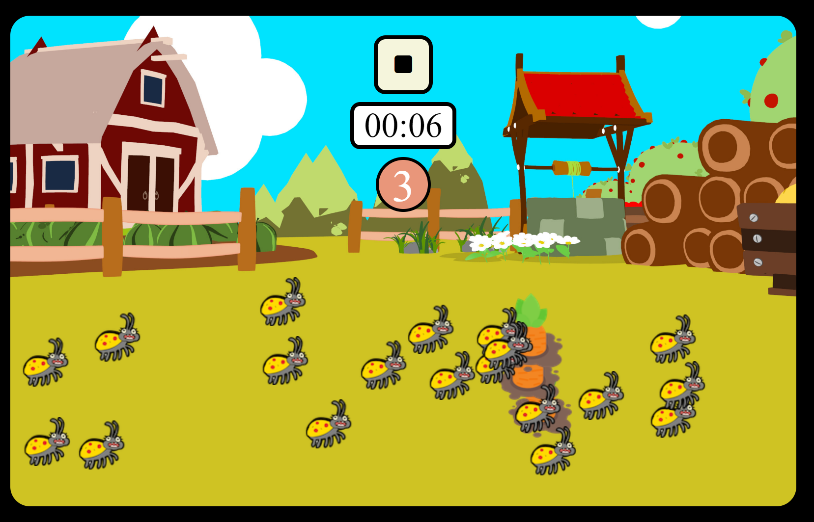
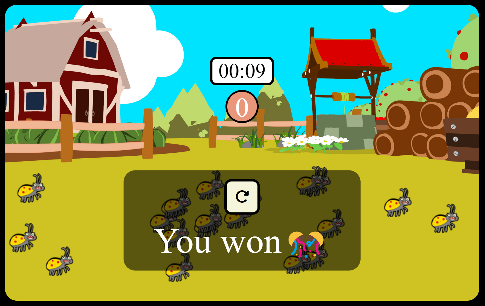
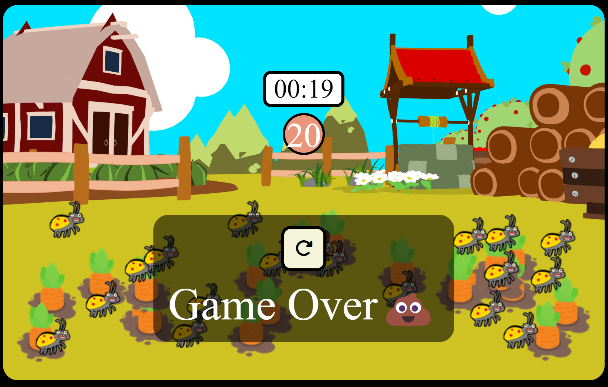
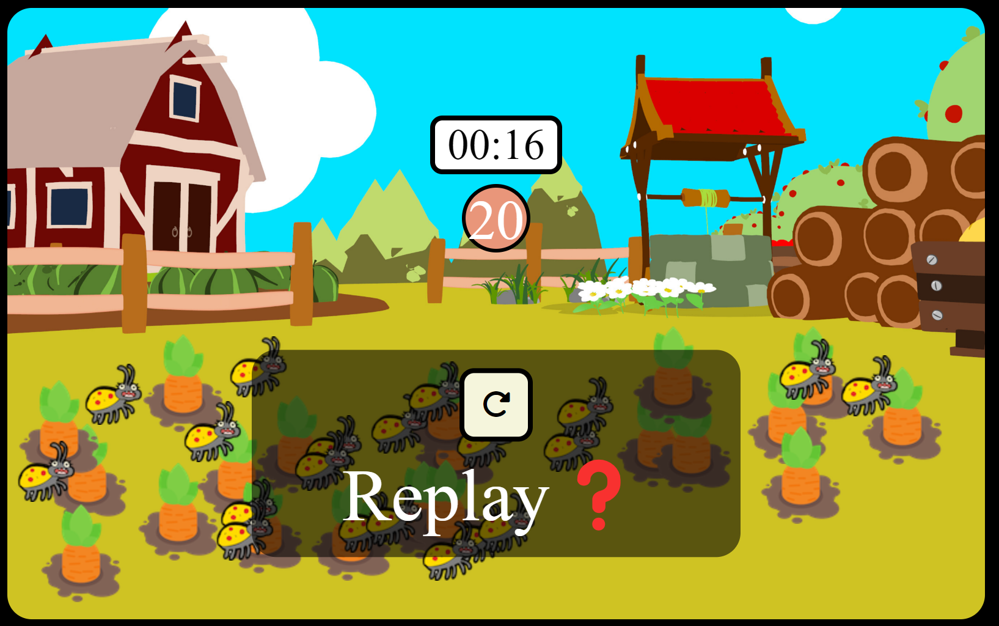
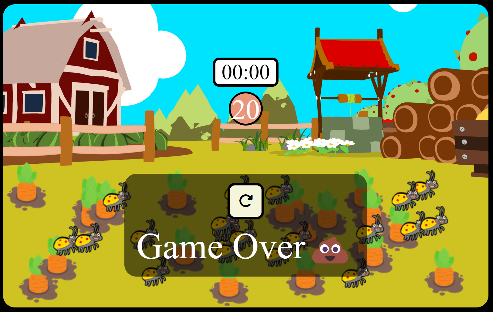

# [Find Carrots](https://seonhyey.github.io/carrot_game/)

A game that users harvest carrots while avoiding bugs.  

## Functions

1. Play button
   

2. Play Game with background music
   

- Change the start button to stop button
- Show
- Start the timer
- Show the number of carrots left

3. When player click the carrots or bug

- Make carrots disappear
  

- Pop up comments with results
  
  

4. Click the stop button while playing the game

- Pop up "Replay?" comments with replay button
- Make it disappear stop button
  

5. When timer is out

- Pop up "Game Over" comments with replay button
  
